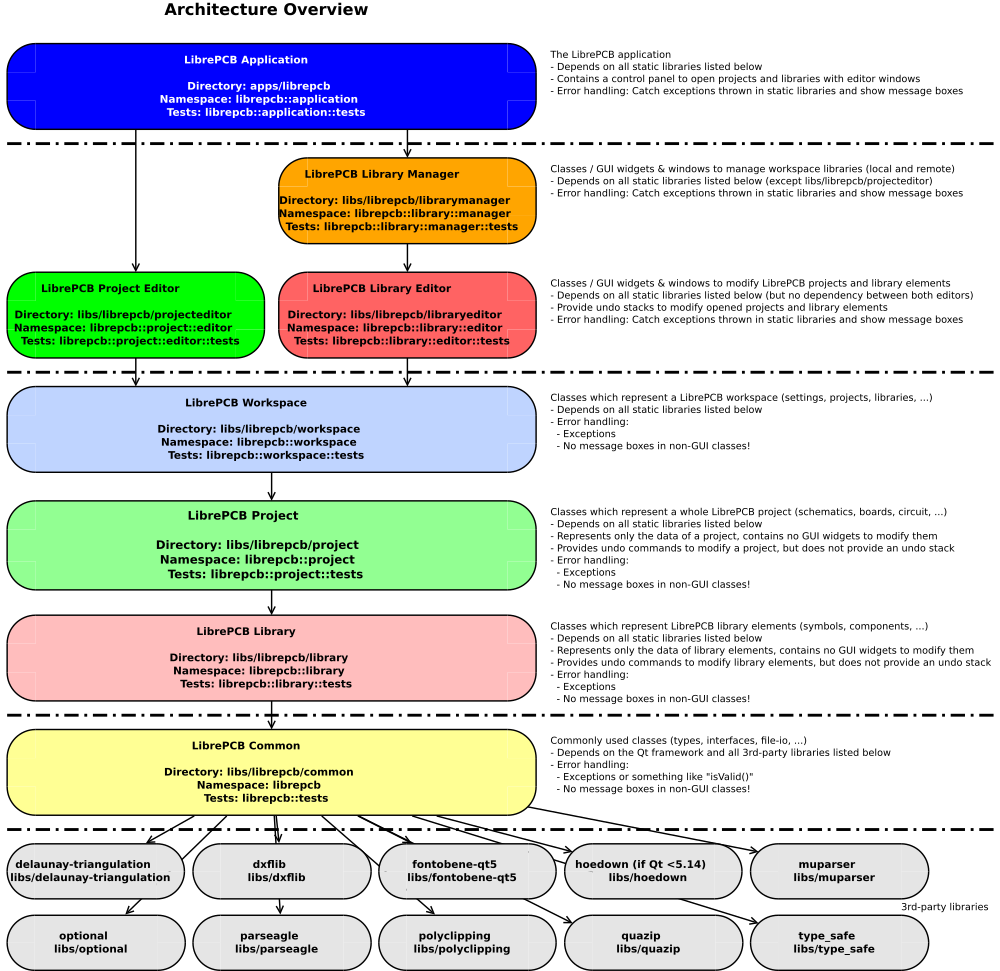

# Applications

This directory contains some qmake projects to build applications, like
- LibrePCB itself
- an importer for Eagle libraries (only for developers)
- a tool to generate random UUIDs (only for developers)
- tools to update workspace and project libraries to a newer file format (only for developers)

The dependencies between applications and static libraries are shown in the [architecture overview diagram](../dev/diagrams/svg/architecture_overview.svg):

